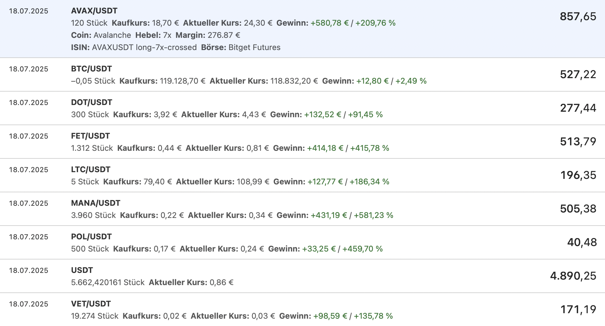
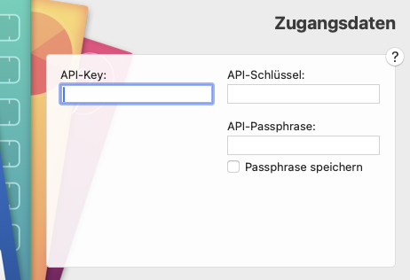

[Lesen Sie dies auf Englisch](README.md)

# MoneyMoney Bitget Extension

Dies ist eine inoffizielle Erweiterung für [MoneyMoney](https://moneymoney-app.com/), die Ihre Spot-Guthaben und Futures-Positionen von [Bitget](https://www.bitget.com/) abruft und als Wertpapiere in MoneyMoney anzeigt.

## Funktionen

- Abruf aller Spot-Guthaben mit aktuellen Marktpreisen
- Abruf aller Futures-Positionen inklusive:
  - Positionsgröße und Hebel
  - Nicht realisierter Gewinn/Verlust (P&L) in EUR mit Prozentangabe
  - Aktueller Mark-Preis
  - Unterstützung für USDT, Universal Margin und USDC Perpetuals
- Anzeige der Positionen als Wertpapiere mit aussagekräftigen Namen
- **Kryptowährungsnamen**: Zeigt vollständige Coin-Namen (z.B. "Polkadot" für DOT) über CoinGecko API
- Getrennte Konten für Spot und Futures
- Erweiterte Anzeige mit zusätzlichen Positionsdetails in MoneyMoney

## Installation

1. Laden Sie `Bitget.lua` herunter
2. Verschieben Sie die Datei in Ihren MoneyMoney Extensions-Ordner
3. Fügen Sie ein neues Konto in MoneyMoney hinzu (Konto > Konto hinzufügen > Andere > Bitget)

## Konfiguration

Sie müssen API-Zugangsdaten bei Bitget erstellen:

1. Melden Sie sich bei Ihrem Bitget-Konto an
2. Gehen Sie zur API-Verwaltung
3. Erstellen Sie einen neuen API-Schlüssel mit folgenden Berechtigungen:
   - **Lesen** (erforderlich)
   - **Spot-Handel** (optional, nur für zukünftige Handelsfunktionen)
   - **Futures-Handel** (optional, nur für zukünftige Handelsfunktionen)
4. Speichern Sie Ihre Zugangsdaten:
   - **API Key** (API-Schlüssel)
   - **Secret Key** (Geheimer Schlüssel - wird nur einmal angezeigt!)
   - **Passphrase** (Passwort, das Sie bei der Erstellung festlegen)

In MoneyMoney verwenden Sie diese Zugangsdaten:

- **API-Key**: Ihr API Key
- **API-Schlüssel**: Ihr Secret Key
- **API-Passphrase**: Ihr Secret Passphrase

## Support

Dies ist eine inoffizielle Erweiterung und steht in keiner Verbindung zu Bitget. Bei Problemen oder Feature-Wünschen erstellen Sie bitte ein Issue auf GitHub.

## Lizenz

MIT-Lizenz - siehe LICENSE-Datei für Details

## Spenden

Wenn Sie diese Erweiterung nützlich finden, können Sie die Entwicklung unterstützen:

- **Bitcoin (BTC)**: `bc1qtez37te8uk8mjfecdtqesg34qent6x04e467fp`
- **Ethereum (ETH)**: `0x6ea8F3531f785f369FAF6967A778f40215D1A3C7`
- **Solana (SOL)**: `Bozp16Pd8qNvZ6puw5Y6J9qkqTmUqtnojCoQE7PkBrt6`
