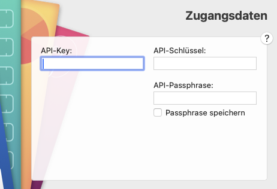

[Read this in German](README.de.md)

# MoneyMoney Bitget Extension

This is an unofficial extension for [MoneyMoney](https://moneymoney-app.com/) that fetches your spot balances and futures positions from [Bitget](https://www.bitget.com/) and displays them as securities in MoneyMoney.

## Features

- Fetches all spot balances with current market prices
- Fetches all futures positions including:
  - Position size and leverage
  - Unrealized P&L in EUR with percentage
  - Current mark price
  - Support for USDT, Universal Margin, and USDC perpetuals
- Shows positions as securities with proper naming
- **Cryptocurrency names**: Displays full coin names (e.g., "Polkadot" for DOT) via CoinGecko API
- Separate accounts for Spot and Futures
- Enhanced display with additional position details in MoneyMoney

## Setup

1. Download `Bitget.lua`
2. Move it to your MoneyMoney Extensions folder
3. Add a new account in MoneyMoney (Account > Add Account > Other > Bitget)

## Configuration

You'll need to create API credentials on Bitget:

1. Log in to your Bitget account
2. Go to API Management
3. Create a new API key with the following permissions:
   - **Read** permission (required)
   - **Spot Trade** permission (optional, only for future trading features)
   - **Futures Trade** permission (optional, only for future trading features)
4. Save your credentials:
   - **API Key**
   - **Secret Key** (shown only once!)
   - **Passphrase** (you set this during creation)

In MoneyMoney, use these credentials:

- **API-Key**: Your API Key
- **API-Schlüssel**: Your Secret Key
- **API-Passphrase**: Your Secret Passphrase

## Support

This is an unofficial extension and not affiliated with Bitget. For issues or feature requests, please open an issue on GitHub.

## License

MIT License - see LICENSE file for details

## Donations

If you find this extension useful, consider supporting the development:

- **Bitcoin (BTC)**: `bc1qtez37te8uk8mjfecdtqesg34qent6x04e467fp`
- **Ethereum (ETH)**: `0x6ea8F3531f785f369FAF6967A778f40215D1A3C7`
- **Solana (SOL)**: `Bozp16Pd8qNvZ6puw5Y6J9qkqTmUqtnojCoQE7PkBrt6`
